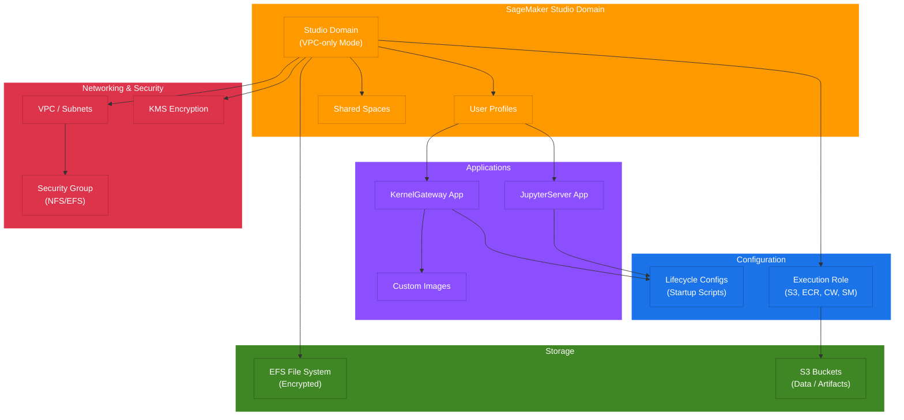

# terraform-aws-sagemaker-studio

Terraform module for provisioning an AWS SageMaker Studio domain with JupyterServer, KernelGateway, VPC-only mode, lifecycle configurations, user profiles, spaces, and custom images.

## Architecture



## Features

- SageMaker Studio Domain with VPC-only network access
- IAM and SSO authentication modes
- Default user settings for JupyterServer and KernelGateway apps
- User profile management
- Shared spaces
- Studio lifecycle configurations
- Custom SageMaker images
- IAM execution role with S3, ECR, CloudWatch, and SageMaker permissions
- Security group for Studio with NFS/EFS support
- KMS encryption support
- EFS encryption

## Usage

### Basic

```hcl
module "sagemaker_studio" {
  source = "terraform-aws-sagemaker-studio"

  domain_name = "my-studio-domain"
  vpc_id      = "vpc-0123456789abcdef0"
  subnet_ids  = ["subnet-0123456789abcdef0"]

  tags = {
    Environment = "dev"
  }
}
```

### With User Profiles and Lifecycle Configs

```hcl
module "sagemaker_studio" {
  source = "terraform-aws-sagemaker-studio"

  domain_name = "my-studio-domain"
  vpc_id      = "vpc-0123456789abcdef0"
  subnet_ids  = ["subnet-0123456789abcdef0"]

  user_profiles = {
    data_scientist = {
      name = "data-scientist"
      tags = { Role = "DataScientist" }
    }
  }

  lifecycle_configs = {
    install_packages = {
      name     = "install-packages"
      app_type = "KernelGateway"
      content  = "#!/bin/bash\npip install pandas scikit-learn"
    }
  }
}
```

## Requirements

| Name | Version |
|------|---------|
| terraform | >= 1.5.0 |
| aws | >= 5.20.0 |

## Inputs

| Name | Description | Type | Default | Required |
|------|-------------|------|---------|----------|
| domain_name | The name of the SageMaker Studio domain | string | n/a | yes |
| vpc_id | The VPC ID for the SageMaker Studio domain | string | n/a | yes |
| subnet_ids | List of subnet IDs for the domain | list(string) | n/a | yes |
| auth_mode | Authentication mode (IAM or SSO) | string | "IAM" | no |
| app_network_access_type | Network access type | string | "VpcOnly" | no |
| kms_key_arn | KMS key ARN for encryption | string | null | no |
| default_user_settings | Default user settings object | object | {} | no |
| user_profiles | Map of user profiles to create | map(object) | {} | no |
| spaces | Map of spaces to create | map(object) | {} | no |
| lifecycle_configs | Map of lifecycle configurations | map(object) | {} | no |
| custom_images | List of custom SageMaker images | list(object) | [] | no |
| enable_efs_encryption | Enable EFS encryption | bool | true | no |
| security_group_ids | Additional security group IDs | list(string) | [] | no |
| tags | Tags to apply to all resources | map(string) | {} | no |

## Outputs

| Name | Description |
|------|-------------|
| domain_id | The ID of the SageMaker Studio domain |
| domain_arn | The ARN of the SageMaker Studio domain |
| domain_url | The URL of the SageMaker Studio domain |
| home_efs_file_system_id | The EFS file system ID for the domain |
| execution_role_arn | The ARN of the SageMaker execution role |
| execution_role_name | The name of the SageMaker execution role |
| security_group_id | The security group ID for Studio |
| user_profile_arns | Map of user profile ARNs |
| space_arns | Map of space ARNs |
| lifecycle_config_arns | Map of lifecycle config ARNs |
| custom_image_arns | List of custom image ARNs |

## Examples

- [Basic](examples/basic/) - Minimal SageMaker Studio domain
- [Advanced](examples/advanced/) - Domain with user profiles and lifecycle configs
- [Complete](examples/complete/) - Full-featured domain with all options

## License

MIT License. See [LICENSE](LICENSE) for details.
